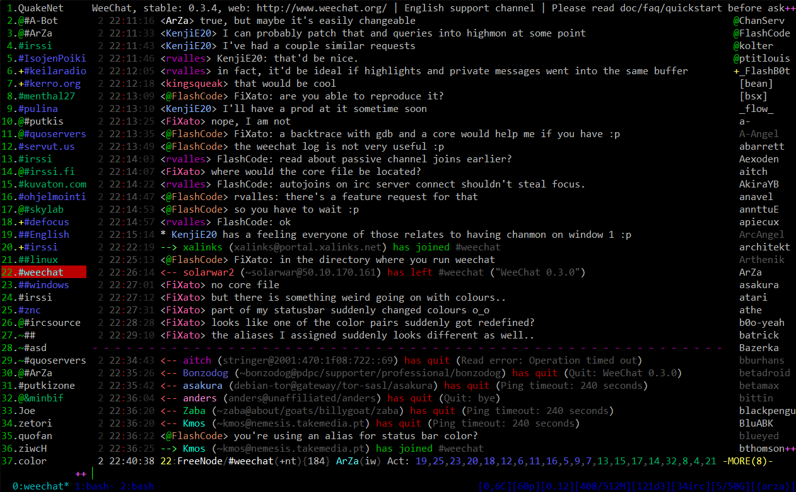

# :eye: :registered: :ocean:


# IRC Server

<p align="center">
  
</p>

## Description
This IRC Server is a high-performance Internet Relay Chat server designed for scalability and extensibility. Built with a focus on security and ease of use, it provides a robust platform for real-time communication across various communities.

## User Story
As an administrator of a large online community, I need a reliable and customizable IRC server to facilitate seamless communication among members, manage channels efficiently, and ensure data security.

## Example Scenarios
- An administrator sets up the IRC Server to support a growing online gaming community, utilizing its advanced features to create a dynamic and engaging environment.
- A tech conference uses the IRC Server to provide real-time chat rooms for attendees, enabling discussions, Q&A sessions, and networking opportunities.

## Getting Started
Please refer to the `Getting started` link for instructions on setting up the IRC Server.

## Prerequisites
- Dependencies and environmental requirements will be listed here.

## Installation Server

```
cd irc
make
```

## Installation Client (Mac)

```
brew install weechat
```

## Usage Server

```
./ircserv <port> <password>
```
Connect to the server using your favorite IRC client at the specified port.

## Usage Client

```
/server add <server.name> <server.ip>/6667 -notls -nosslwee

Turn off debugging messages:
/set weechat.network.gnutls_log_level 1
```

## Contributing
We welcome contributions. Please read `CONTRIBUTING.md` for details on our code of conduct and the process for submitting pull requests to us.

## License
This project is licensed under the MIT License - see the `LICENSE.md` file for details.

## Acknowledgments
- Inspired by the resilience and adaptability of the the creature, this project aims to provide a similarly robust and flexible platform for online communication.

## Links / Further Information
- [GitHub Repository Link]
- [Documentation]
- [User Guide]

## Contributors 
Gero Böhm (https://github.com/gero-boehm)  
Christian Meng (https://github.com/Christwelve)  

---


# Client -> Server communication

QUIT :<quit message>

NICK <new-nickname>

USER <username> <hostname> <servername> :<realname>

JOIN <#channelname>

PART <#channelname>

PRIVMSG <#channelname>/<nickname> :<message>

PRIVMSG nickname :<message>

KICK <#channelname> <nickname> :<reason>

INVITE <nickname> <#channelname>

TOPIC <#channelname> :<new topic>

LIST

MODE <#channelname>/<nickname> <mode>


# Server -> Client communication

QUIT 	->		(to all other users of a channel): :Nickname!Username@hostname QUIT :Quit: quit message

NICK 	->		:NICK <old-nickname> <new-nickname>
			:server ERR_NICKNAMEINUSE * <new-nickname> :Nickname is already in use

USER 	->		:server 001 <nickname> :Welcome to the Internet Relay Network <nick>!<user>@<host>

JOIN 	->		:Nick!User@host JOIN :#channelname
			:server 332 <nickname> #channelname :<topic>
			:server 353 <nickname> = #channelname :<nicknames>

PART 	->		:Nick!User@host PART #channelname

PRIVMSG ->		:Nick!User@host PRIVMSG #channelname :<message>
			:server ERR_CANNOTSENDTOCHAN <nickname> #channelname :Cannot send to channel

PRIVMSG	->		:Nick!User@host PRIVMSG <nickname> :<message>
			:server ERR_NOSUCHNICK <nickname> :No such user

KICK 	->		:Nick!User@host KICK #channelname <nickname> :<reason>

INVITE 	->		:Nick!User@host INVITE <nickname> :#channelname

TOPIC 	->		:server 332 <nickname> #channelname :<topic>

LIST	->		:server 322 <nickname> #channelname <user count> :<topic>
			:server 323 <nickname> :End of LIST

MODE 	->		:Nick!User@host MODE #channelname :<mode>


>client 4: NICK cmeng
>
>client 4: USER cmeng 0 * :cmeng
>
>USER <username> <hostname> <servername> :<realname>
>


